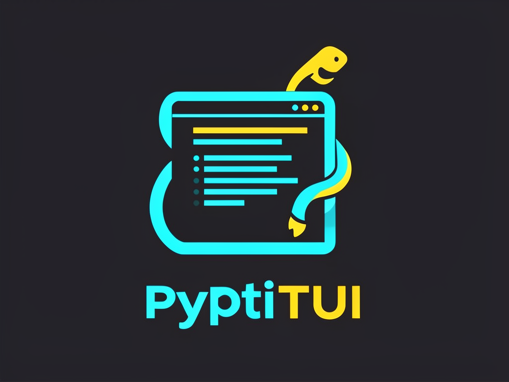

<p align="center">
  
</p>

<h1 align="center">PyPiTUI</h1>

<p align="center">
  <b>Build terminal UIs in Python with React-like components</b><br>
  Differential rendering · Scrollback support · Kitty protocol · Rich integration
</p>

<p align="center">
  <a href="https://github.com/jeremysball/pypitui/blob/main/LICENSE">
    
  </a>
  <a href="https://pypi.org/project/pypitui/">
    
  </a>
  <a href="https://pypi.org/project/pypitui/">
    
  </a>
</p>

---

## About

PyPiTUI is a Python terminal UI library inspired by [pi-tui](https://github.com/badlogic/pi-mono/tree/main/packages/tui). It brings React's component model to terminal applications with **differential rendering**—only changed lines update, eliminating flicker.

Unlike curses-based TUIs that clip content, PyPiTUI uses the terminal's native scrollback buffer. Your content flows naturally, accessible with Shift+PgUp or mouse wheel.

**Key differentiators:**
- 🚀 **Differential rendering** - Flicker-free updates at 60fps
- 📜 **Native scrollback** - Content flows into terminal history
- 🎨 **Rich integration** - Markdown, tables, syntax highlighting (optional)
- ⌨️ **Kitty protocol** - Key release/repeat events
- 🪟 **Overlays** - Modal dialogs with flexible positioning

---

## Installation

```bash
pip install pypitui

# With Rich integration for markdown, tables, and markup
pip install pypitui[rich]
```

**Requirements:** Python 3.10+

---

## Quick Start

```python
from pypitui import TUI, Text, Input, ProcessTerminal, Key, matches_key

# Create terminal and TUI
terminal = ProcessTerminal()
tui = TUI(terminal)

# Add components
tui.add_child(Text("Hello, World!"))

input_field = Input(placeholder="Type something...")
input_field.on_submit = lambda text: print(f"You typed: {text}")
tui.add_child(input_field)
tui.set_focus(input_field)

# Run the TUI
tui.start()
try:
    while True:
        data = terminal.read_sequence(timeout=0.1)
        if data:
            if matches_key(data, Key.ctrl("c")):
                break
            tui.handle_input(data)
        tui.request_render()
        tui.render_frame()
finally:
    tui.stop()
```

**Or use the built-in loop:**

```python
tui.run()  # Handles everything at ~60fps
```

---

## Features

### Differential Rendering

Only changed lines are redrawn. No flickering, even with rapid updates.

```python
# Status updates are smooth
status = Text("Processing...")
tui.add_child(status)

# Update without flicker
status.set_text("Done!")
tui.request_render()
```

### Native Scrollback

Content flows into the terminal's scrollback buffer. No artificial clipping.

```python
# Log streaming - all history accessible
for line in log_lines:
    tui.add_child(Text(line))  # Flows into scrollback naturally
```

Use **Shift+PgUp** or mouse wheel to scroll through history.

### Component-Based Architecture

Build UIs with composable components:

```python
from pypitui import Container, Text, Input, SelectList, SelectItem

# Compose a form
form = Container()
form.add_child(Text("User Registration"))
form.add_child(Input(placeholder="Username"))
form.add_child(Input(placeholder="Email", max_length=100))
form.add_child(SelectList(items, max_visible=5, theme=theme))

tui.add_child(form)
```

### Rich Integration (Optional)

```python
from pypitui.rich_components import Markdown, RichTable, RichText

# Markdown rendering
md = Markdown("# Hello\n\n- Item 1\n- Item 2")

# Rich text markup
text = RichText("[bold cyan]Hello[/bold cyan] [red]World[/red]!")

# Tables
table = RichTable(title="Results")
table.add_column("Name", style="cyan")
table.add_column("Value", style="green")
table.add_row("Item 1", "100")
```

See `examples/rich_integration.py` for the full demo.

---

## Components

### Text

Multi-line text with word wrapping and padding.

```python
text = Text("Hello World", padding_x=1, padding_y=1)
text.set_text("Updated content")
text.set_custom_bg_fn(lambda line: f"\x1b[44m{line}\x1b[0m")  # Blue background
```

### Input

Text input with cursor and validation.

```python
input_field = Input(
    placeholder="Enter text...",
    password=False,
    max_length=100  # Optional validation
)
input_field.on_submit = lambda value: print(f"Submitted: {value}")
input_field.on_cancel = lambda: print("Cancelled")

tui.set_focus(input_field)
```

**Key bindings:** ←/→ move, Home/Ctrl+A start, End/Ctrl+E end, Backspace/Delete, Ctrl+U delete to start, Ctrl+K delete to end, Enter submit, Escape cancel.

### SelectList

Interactive selection with filtering.

```python
from pypitui import SelectList, SelectItem, SelectListTheme

items = [
    SelectItem("a", "Option A", "Description here"),
    SelectItem("b", "Option B"),
]

select = SelectList(items, max_visible=5, theme=SelectListTheme())
select.on_select = lambda item: print(f"Selected: {item.value}")
select.on_cancel = lambda: print("Cancelled")

tui.set_focus(select)
```

**Key bindings:** ↑/↓ navigate, Enter select, Escape cancel/clear filter, type to filter.

### BorderedBox

Panel with borders and automatic content wrapping.

```python
box = BorderedBox(
    padding_x=1,
    padding_y=0,
    title="My Panel"
)
box.add_child(Text("Content wraps automatically"))
```

Renders as:
```
┌─────────────────────────────┐
│ My Panel                    │
├─────────────────────────────┤
│ Content wraps automatically │
└─────────────────────────────┘
```

### Container

Groups components vertically. Essential for screen switching.

```python
root = Container()
root.add_child(Text("Screen 1"))

# Switch screens (REUSE the TUI instance!)
root.children.clear()
root.add_child(Text("Screen 2"))
```

**⚠️ Important:** Reuse the TUI instance when switching screens. Creating new TUI instances loses differential rendering state and causes ghost content.

### Overlays

Floating panels for dialogs and modals.

```python
from pypitui import OverlayOptions, OverlayMargin

dialog = BorderedBox(title="Confirm")
dialog.add_child(Text("Are you sure?"))

options = OverlayOptions(
    width="50%",           # or absolute: 40
    min_width=20,
    max_height=10,
    anchor="center",       # "center", "top", "top-left", etc.
    margin=OverlayMargin(2, 4, 2, 4)  # top, right, bottom, left
)

handle = tui.show_overlay(dialog, options)
handle.hide()              # Permanently remove
handle.set_hidden(True)    # Temporarily hide
```

---

## Keyboard Input

```python
from pypitui import matches_key, Key, parse_key
from pypitui import EVENT_PRESS, EVENT_RELEASE, EVENT_REPEAT

# Match specific keys
if matches_key(data, Key.escape): ...
if matches_key(data, Key.ctrl("c")): ...
if matches_key(data, Key.ctrl_shift("p")): ...

# Parse for advanced handling
key_id, event_type = parse_key(data)
if event_type == EVENT_RELEASE:
    return  # Ignore key releases
```

**Available keys:** `Key.up`, `Key.down`, `Key.left`, `Key.right`, `Key.enter`, `Key.escape`, `Key.tab`, `Key.backspace`, `Key.f1` through `Key.f12`, and modifier methods `Key.ctrl()`, `Key.shift()`, `Key.alt()`, `Key.ctrl_shift()`, etc.

### Kitty Keyboard Protocol

Enable for key release/repeat events:

```python
from pypitui.keys import set_kitty_protocol_active

set_kitty_protocol_active(True)

# In component
@property
def wants_key_release(self) -> bool:
    return True
```

---

## Examples

Clone and run the examples:

```bash
git clone https://github.com/jeremysball/pypitui.git
cd pypitui
uv sync --extra dev

# Simple menu
uv run python examples/simple_menu.py

# Full feature demo
uv run python examples/demo.py

# Rich integration
uv run python examples/rich_integration.py

# Scrollback demo
uv run python examples/scrollback_demo.py
```

---

## Utilities

```python
from pypitui import (
    visible_width,      # Width ignoring ANSI codes
    truncate_to_width,  # Truncate with ellipsis
    wrap_text_with_ansi # Word wrap preserving colors
)

# Get visible width (ANSI codes don't count)
visible_width("\x1b[31mhello\x1b[0m")  # 5

# Truncate to width
truncate_to_width("hello world", 8)  # "hello..."

# Wrap text preserving ANSI codes
lines = wrap_text_with_ansi("colored text here", width=20)
```

---

## Documentation

- **[LLMS.md](LLMS.md)** - Comprehensive API reference and patterns
- **[examples/](examples/)** - Working code examples
- **[tests/](tests/)** - Test suite demonstrating usage

---

## Development

```bash
# Clone repository
git clone https://github.com/jeremysball/pypitui.git
cd pypitui

# Install with dev dependencies
uv sync --extra dev

# Run tests
uv run pytest -v

# Run linting
uv run ruff check .

# Type checking
uv run mypy src/
```

---

## Contributing

Contributions are welcome! Please:

1. Fork the repository
2. Create a feature branch (`git checkout -b feature/amazing-feature`)
3. Make your changes
4. Run tests (`uv run pytest`)
5. Commit (`git commit -m 'Add amazing feature'`)
6. Push (`git push origin feature/amazing-feature`)
7. Open a Pull Request

---

## Acknowledgments

- Inspired by [pi-tui](https://github.com/badlogic/pi-mono/tree/main/packages/tui) by [@mariozechner](https://github.com/mariozechner)
- [Rich](https://github.com/Textualize/rich) for text rendering and markup

---

## License

MIT License - see [LICENSE](LICENSE) file.
