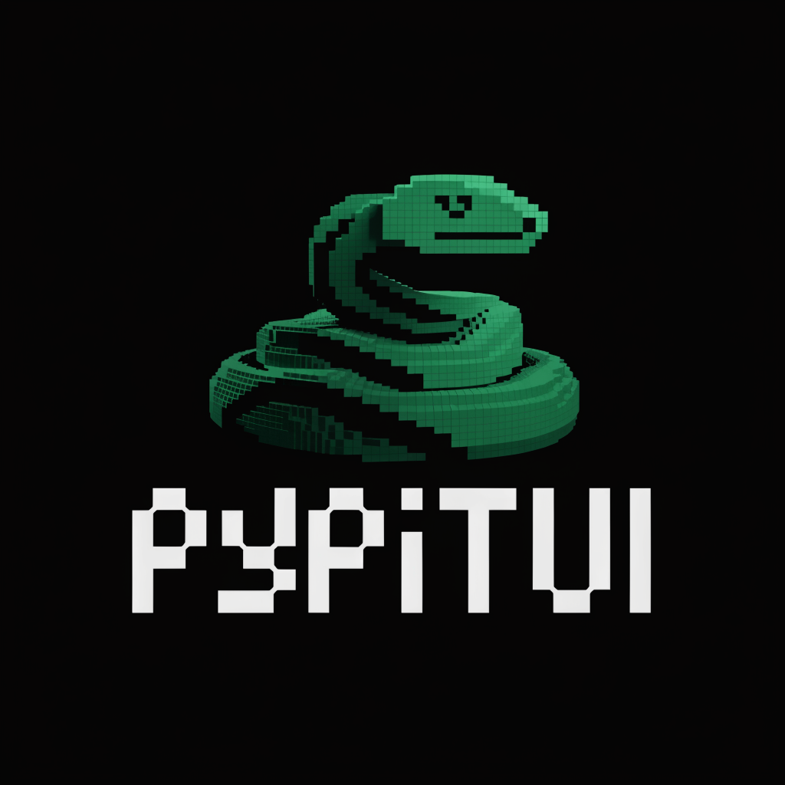

<p align="center">
  
</p>

<p align="center">
  <b>Terminal UIs that don't flicker. Native scrollback. 60fps.</b>
</p>

<p align="center">
  <a href="https://pypi.org/project/pypitui/"></a>
  <a href="https://pypi.org/project/pypitui/"></a>
  <a href="https://github.com/jeremysball/pypitui/blob/main/LICENSE"></a>
</p>

---

```python
from pypitui import TUI, Text, Input, ProcessTerminal

terminal = ProcessTerminal()
tui = TUI(terminal)

tui.add_child(Text("Hello, World!"))

inp = Input(placeholder="Type here...")
inp.on_submit = lambda v: print(f"You typed: {v}")
tui.add_child(inp)
tui.set_focus(inp)

tui.run()  # 60fps, no flicker, scrollback enabled
```

## Why PyPiTUI?

| Library | Rendering | Scrollback | 60fps | Size |
|---------|-----------|------------|-------|------|
| curses | Full redraw | ❌ | ❌ | Built-in |
| Textual | Full redraw | ❌ | ⚠️ | ~50MB |
| Rich (Live) | Full redraw | ❌ | ⚠️ | ~10MB |
| **PyPiTUI** | **Differential** | **✓** | **✓** | **~100KB** |

Only changed lines redraw. No alternate screen buffer—your content flows into normal terminal scrollback.

## Install

```bash
pip install pypitui
# pip install pypitui[rich]  # Optional: markdown, tables
```

Requires Python 3.12+.

## Quick Start

```python
from pypitui import (
    TUI, Container, Text, Input, SelectList, SelectItem,
    BorderedBox, ProcessTerminal, Key, matches_key
)

class App:
    def __init__(self):
        self.terminal = ProcessTerminal()
        self.tui = TUI(self.terminal)
        self.root = Container()
        self.tui.add_child(self.root)
        self.show_form()

    def show_form(self):
        """Compose a form from multiple components."""
        self.root.children.clear()

        # Container composes children vertically
        self.root.add_child(Text("User Registration"))
        self.root.add_child(Text("─" * 30))

        # Input with validation
        name_input = Input(placeholder="Enter username", max_length=20)
        self.root.add_child(name_input)

        # Another input
        email_input = Input(placeholder="Enter email")
        self.root.add_child(email_input)

        # Bordered box containing a list
        box = BorderedBox(title="Select Role")
        roles = SelectList([
            SelectItem("admin", "Administrator"),
            SelectItem("user", "Standard User"),
        ], max_visible=3)
        box.add_child(roles)
        self.root.add_child(box)

        self.tui.set_focus(name_input)

    def run(self):
        self.running = True
        self.tui.start()
        try:
            while self.running:
                data = self.terminal.read_sequence(timeout=0.05)
                if data and matches_key(data, Key.ctrl("c")):
                    break
                self.tui.handle_input(data)
                self.tui.request_render()
                self.tui.render_frame()
        finally:
            self.tui.stop()

App().run()
```

## Components

- `Text` — Multi-line text with wrapping
- `Input` — Text input with cursor, validation
- `SelectList` — Interactive selection with filtering
- `BorderedBox` — Panel with borders and title
- `Container` — Groups components vertically
- `OverlayOptions` — Floating dialogs and modals

## Critical Pattern: Reuse the TUI

**Wrong:** Creating new TUI instances breaks differential rendering.

```python
# ❌ DON'T
def switch_screen():
    return TUI(terminal)  # Loses state!
```

**Right:** Clear containers, not the TUI.

```python
# ✅ DO
class App:
    def __init__(self):
        self.tui = TUI(terminal)  # Create once
        self.root = Container()
        self.tui.add_child(self.root)

    def switch_screen(self):
        self.root.children.clear()  # Clear container
        self.root.add_child(Text("New Screen"))
```

## Rich Integration

Optional [Rich](https://github.com/Textualize/rich) support for markdown and tables:

```python
from pypitui.rich_components import Markdown, RichTable, RichText

tui.add_child(Markdown("# Hello\n\n**Bold** text"))
```

## Development

```bash
git clone https://github.com/jeremysball/pypitui.git
cd pypitui && uv sync --extra dev

# Install pre-commit hooks (runs ruff, mypy, pytest)
git config core.hooksPath .githooks

uv run python examples/demo.py
```

## API Reference

| Import | Purpose |
|--------|---------|
| `TUI` | Main controller |
| `Container`, `Text`, `Input`, `SelectList`, `BorderedBox` | Components |
| `OverlayOptions`, `OverlayMargin` | Overlay positioning |
| `Key`, `matches_key`, `parse_key` | Keyboard handling |
| `ProcessTerminal`, `MockTerminal` | Terminal I/O |

Full docs: [`LLMS.md`](LLMS.md)

## License

MIT — see [LICENSE](LICENSE).

---

<p align="center">
Inspired by <a href="https://github.com/badlogic/pi-mono/tree/main/packages/tui">pi-tui</a>
</p>
